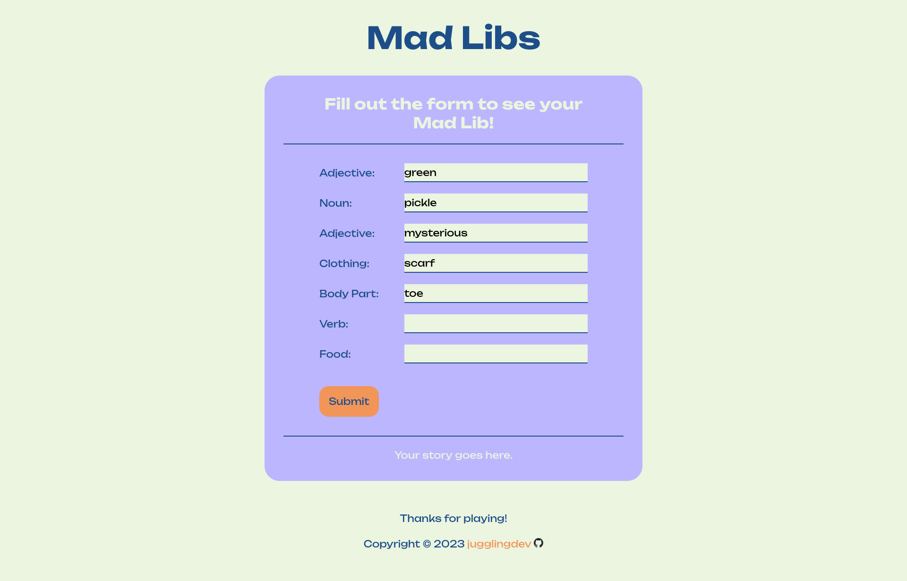
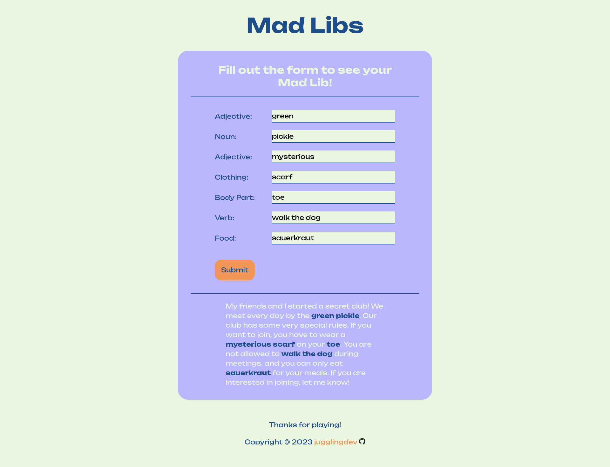

# Title

This is a solution to the [Code Labs](https://www.codelabsdash.com/applicant/prework/project) Mad Libs project.

## Table of contents

- [Title](#title)
  - [Table of contents](#table-of-contents)
  - [Overview](#overview)
    - [Screenshots](#screenshots)
    - [Links](#links)
  - [My process](#my-process)
    - [Built with](#built-with)
    - [What I learned](#what-i-learned)
    - [Continued development](#continued-development)
    - [Useful resources](#useful-resources)
  - [Author](#author)
  - [Acknowledgments](#acknowledgments)

## Overview

### Screenshots

*Mad Libs screenshot:*


*Mad Libs screenshot with completed story:*


### Links

- Solution URL: [Mad Libs Solution](https://github.com/jugglingdev/mad-libs)

- Live Site URL: [Mad Libs Live Site](https://jugglingdev.github.io/mad-libs/)

## My process

### Built with

- Semantic HTML5
- CSS variables
- Flexbox
- Google Fonts
- Favicon

### What I learned

In this project, I decided to apply what I learned in the CodeLabs prework courses.  Although I had already studied HTML, CSS, and JavaScript, I still learned new skills and tools such as Dave Gray's method of using CSS variables and organizing the CSS code.

For my Mad Libs, I used brief comments as headers for the different sections in the CSS.  These would look like:

```css
/* || RESET */

/* || UTILITIES */

/* || VARIABLES */
```

Some new ideas I incorporated into this project included putting the `font-family` in the global reset and adding utilities classes for `text-align: center` and `white-space: nowrap`.

At first, I didn't like how Dave Gray used all caps for his CSS variables, but surprisingly, it grew on me as I found it easier to read.  Any time I had 2 or more of the same lines of code, I created a variable for it, following the DRY principle.  Making the variables and organizing them was so much fun!  It made me excited to work with CSS.

A couple new values I used were `clamp()` and `min()`.  It was nice to use those in place of multiple `@media` queries.  The few adjustments I did make were for small screens only and mainly to accommodate the font.

Another favorite part of this project was using [Coolors](https://coolors.co/) to generate a fun color palette.  I waited until I found a color I liked, then I locked it in place and kept going until I had a completed palette.

In the JavaScript, I got to use `event.preventDefault()` and `scrollIntoView()` for the first time.  The first was to make sure the page didn't reload after clicking the submit button.  The second was to automatically scroll down to see the completed Mad Lib after entering all required fields and clicking submit.  I'm really happy that worked out easily.

Overall, this was a good experience where I got to learn some new tricks across HTML, CSS, and JavaScript.  One of my previous goals was to work on cleaning up my code, and I definitely feel like this experience helped with that.

### Continued development

In future projects, I'd like to work with APIs and `async`/`await` more.  That's probably the concept that is most mysterious to me at this point in my journey.  I certainly appreciate the exposure during the prework!

### Useful resources

- [Coolors Color Palette Generator](https://coolors.co/) - Great site for generating color palettes.

## Author

- Kayla Paden - Find me at [GitHub](https://github.com/jugglingdev), [freeCodeCamp](https://www.freecodecamp.org/jugglingdev), [Frontend Mentor](https://www.frontendmentor.io/profile/jugglingdev), [LinkedIn](https://www.linkedin.com/in/kayla-marie-paden)

## Acknowledgments

Shoutout to CodeLabs for putting together an awesome prework collection of video tutorials and projects!
